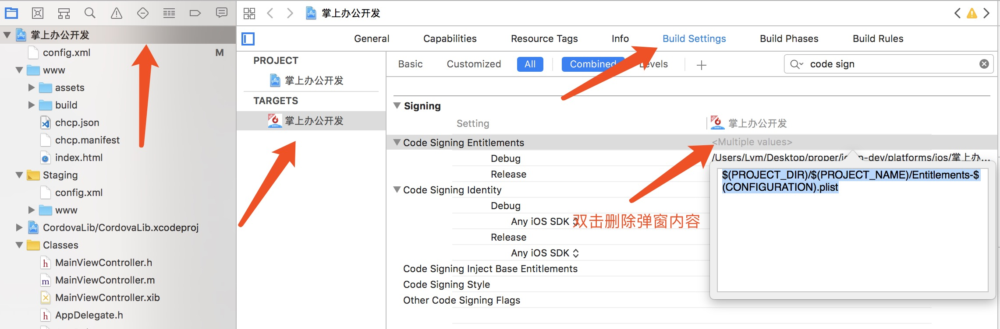
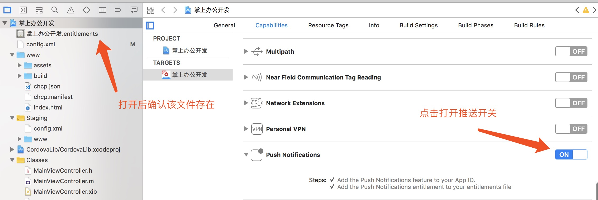

iCooperation Management Platform App
====================================

环境准备
-------
### 必备软件

* [git](http://www.git-scm.com/) - 版本控制及与 GitHub 交互
* [Node.js](https://nodejs.org/) - 前端开发环境所需工具的包管理器，以及运行代理服务器必备环境
* [ruby](http://www.ruby-lang.org/) - [SASS/SCSS](http://sass-lang.com/) 编译工具的运行环境（mac系统自带该软件不用安装）
* [JDK](http://www.oracle.com/technetwork/java/javase/downloads/jdk8-downloads-2133151.html) - 在Android上运行需要java编译环境，必须1.8
* [SDK](https://developer.android.com/studio/index.html?hl=zh-cn) - 需要在Android上运行时安装

> Windows 环境下安装时需注意添加环境变量，以方便在命令行下使用

##### 设置npm全局安装路径和缓存路径

```
$ npm config set prefix "C:\Program Files\nodejs"
$ npm config set cache "C:\Program Files\nodejs\node_cache"
```

运行方式
-------

* 因ionic自动编译拷贝有bug，windows环境需要在目录[src]下新建两个文件[manifest.json][service-worker.js]，并在[package.json]文件的dependencies下添加["sw-toolbox": "3.6.0"]。
#### 注意：windows一定不要把自己添加的这三个文件提交到代码库

```
# 安装全局命令行组件
$ npm install grunt-cli -g
$ npm install -g cordova ionic
$ npm install -g cordova-hot-code-push-cli

# 在windows下安装的编译环境插件
$ npm install --global --production windows-build-tools
$ npm config set msvs_version 2015 --global

# 安装 SCSS 编译环境
$ gem install sass
$ gem install compass

# Unix 环境下可使用 pm2 组件作为任务管理器，方便开发时自动更新后台代理服务器
# Windows 环境暂未找到替代方案，需手动重启代理服务器以便修改生效，手动启动方式见下
$ npm install pm2 -g

# 安装项目依赖的组件
$ npm install

# 发布静态资源，通过浏览器访问，自动更新变化(可使用pm2时)
$ npm run serve
# 也可连接实际后端服务器运行
$ npm run serve:real
# windows因不能使用pm2，启动命令不同
$ npm run serve:win
# 当需要启动后端代理服务器时，需手动启动，修改后也需手动重启
$ node proxy/proxy-server.js

# 通过 pm2 查看后端代理服务器的日志
$ pm2 logs

# 进行ts代码检查
$ npm run lint

# 发布版
# 会按照 ionic.config.json 中的 currentProject 替换 custom_contents/customs.json 相应项目配置参数
# 安卓
$ npm run build:releaseAndroid
# 苹果
$ npm run build:releaseIOS
# 只生成热部署资源
$ npm run build:hcp

# 产品版本升级
# 按照 ionic.config.json 中的 version 自动更改相关文件
$ npm run bumpVer

# 在Android上运行APP，参数--prod会对代码进行压缩
$ ionic cordova run android [--prod]
# 在IOS虚拟机上运行APP
$ ionic cordova run ios [--prod]

```

### android及ios程序调试方法

- [Chrome调试Android应用](https://www.jianshu.com/p/2a3e3f0b562b)
- [Safari调试iOS应用](http://ask.dcloud.net.cn/docs/#http://ask.dcloud.net.cn/article/143)

### 使用代理数据转接口
- 如果在后台接口不改变的情况下，需要使用新的前台，则需要用到转接口使之接口对应。
- 使用命令node proxy/adapter-proxy-server.js启动转接口代理
- 如果需要修改后台地址，在/proxy/adapters/common.js中，修改common.hostname, common.port, common.path = '/mobile-platform'


桌面运行
------

### Windows

可使用 [蓝叠模拟器](http://www.bluestacks.cn/) 安装 apk 使用

### MacOS

```
$ npm install
## modify currentProject in ionic.config.json to choose version
## $ vi ionic.config.json
$ npm run grunt:releaseIOS
$ cordova plugin rm cordova-plugin-proper-HuanXin-iOS
$ cordova plugin add cordova-plugin-proper-HuanXin-iOS
$ ionic cordova emulate ios --livereload [--target=iPhone-7]
```

> 无法弹出键盘时，可通过 `command + k` 触发

iOS 打包
-----

没有证书的移步该网站 [iOS 企业版打包流程](https://www.jianshu.com/p/5866152476df)

如果使用已经有该证书的电脑打包，以**掌上办公开发**为例，输入以下步骤执行即可：


1. **npm run releaseIOS**  
`这一步执行完后，实际上已经打出 ipa 了，但是必须执行 2、3 步骤才能正确设置推送配置。`

2. **设置 code sign**  
`打开项目文件 platforms/ios/掌上办公开发.xcworkspace`


3. **打开推送开关**  
`如果最后没有生成 .entitlements 文件，则重新从步骤2开始执行`


4. 前三步完成后可以选择使用以下命令进行打包  

```
ionic cordova build ios --prod --release --device --no-interactive --buildConfig build.json
// 打包完成后 ipa 路径为 platforms/ios/build/device/掌上办公开发.ipa
```
或者使用上面提到的 [iOS 企业版打包流程](https://www.jianshu.com/p/5866152476df) 中 13-14 步骤进行打包也可以。
